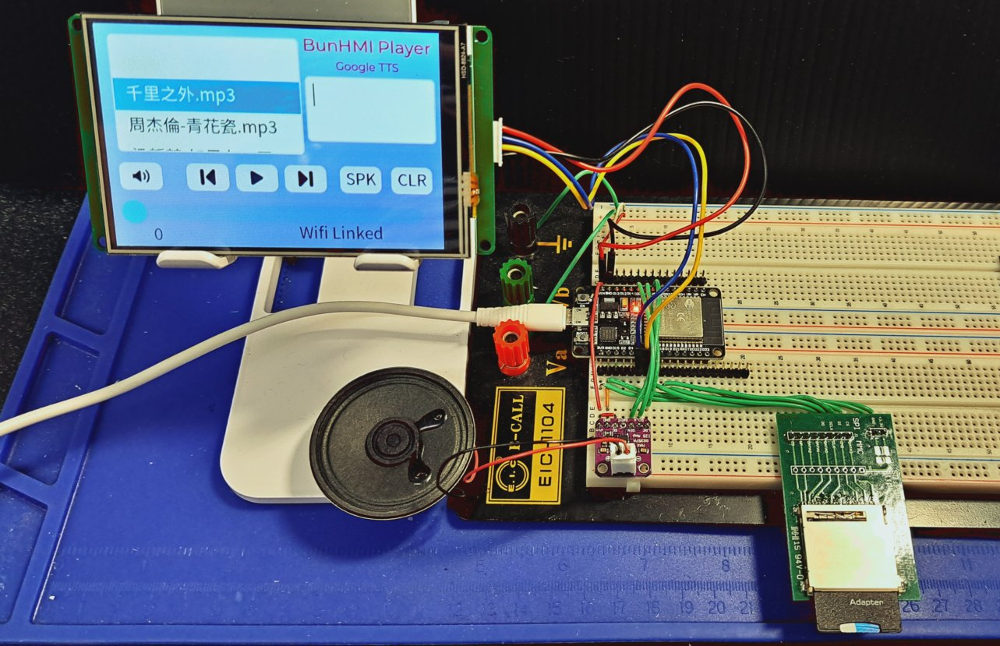
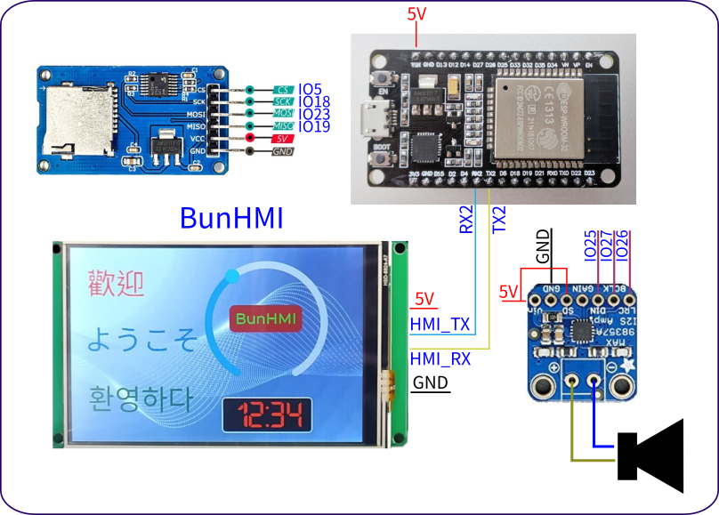
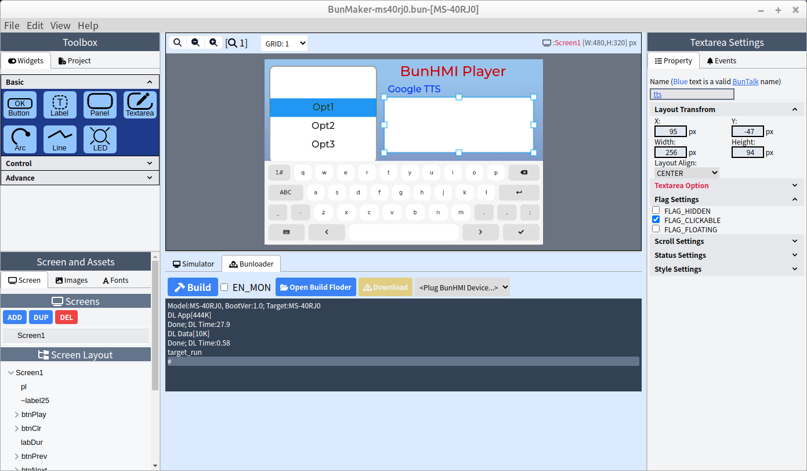

# BunHMI_esp32_audio_player
ESP32 audio player by using https://github.com/schreibfaul1/ESP32-audioI2S and [BunHMI](https://shop.mcuidea.com/) display

Feature list
* Play MP3 from SDCard.
* GUI control interface by using BunHMI display.
* Select MP3 by rolling bar.
* Select Next and Prev
* Volume control
* Google Text-to-Speech.

# Youtube Video
Video description: https://www.youtube.com/watch?v=JTzdi1hMd7A

## Audio output
This project using MAX98357A as audio output. which only has single channel output. You can add another channel to achieve sterio output easily. Please refer MAX98357A datasheet.

## Schematic
Here is the schematic, which only using few signal wires.

## BunHMI

The "BunHMI" folder includes the BunMaker project. you can open project by BunMaker: https://shop.mcuidea.com/bunmaker

## ESP32 code
 The "I2Saudio_SDCard" folder includes esp32 arduino source code.

